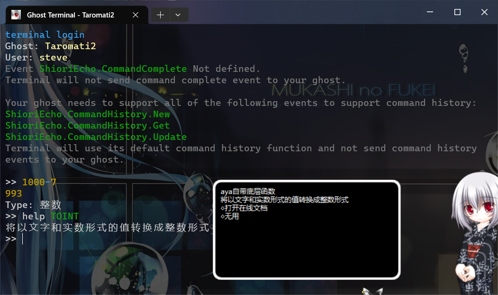

### ghost_terminal  

[SSTP_linker]( https://github.com/Taromati2/SSTP_linker )试做品  

### 用法  
如同系统终端般使用ghost_terminal  
up/down切换命令，鼠标右键快速粘贴，不支持tab补全  
键入你的人格所支持的表达式随后对其求值！  
便于人格开发（实际上是相当没用的东西我知道了别骂了本就是试做品我知道现在的人格都有拖入表达式进行操作的功能哪用得到什么终端啊）  

### 需求  
支持`ShioriEcho`、`ShioriEcho.GetResult`的人格  
如[Taromati2]( https://github.com/Taromati2/Taromati2 )  
Ps：`ShioriEcho.GetName`、`ShioriEcho.End`可选  

ghost_terminal通过`X-SSTP-PassThru-*`进行与人格间的信息沟通（见[文档]( http://ssp.shillest.net/ukadoc/manual/spec_shiori3.html )）  
相关约定与范例见下  

- `ShioriEcho`  
  命令键入完毕后事件  
  * `Reference0`  
	终端所收集到的命令  
  * 返值  
	忽略，**但言灵正常执行**  
  * 示例  
	```
	// request
	GET SHIORI/3.0
	Charset: UTF-8
	Sender: Ghost Terminal
	SenderType: external,sstp
	SecurityLevel: local
	Status: balloon(0=0)
	ID: ShioriEcho
	Reference0: 1000-7


	// response (Execution time : 0[ms])
	SHIORI/3.0 200 OK
	Sender: AYA
	Charset: UTF-8
	Value: \0\s[0]表达式『\_q1000-7\_q』的执行结果为：\n\_q993\n类型：整数\_q\n\q[◇复制结果,OnCopy,"993"]\n\q[◇复制表达式,OnCopy,"1000-7"]\n\q[◇结果作Sakura Script執行,OnSakuraScript,"993"]\n\n\q[◇求值下一个,OnCalculateVar]\n\q[◇无用,Cancel]\n\eb25jZSBzbyBkaXNwb3NhYmxl
	```
- `ShioriEcho.GetResult`  
  查询求值结果事件  
  * 可能返值1  
	- `X-SSTP-PassThru-Result`  
	  显示内容并进入下一命令的获取  
	- `X-SSTP-PassThru-Type`（可选）  
	  补充信息：值类型  
	- 示例  
	  ```
	  // request
	  GET SHIORI/3.0
	  Charset: UTF-8
	  Sender: Ghost Terminal
	  SenderType: external,sstp
	  SecurityLevel: local
	  Status: talking,balloon(0=0)
	  ID: ShioriEcho.GetResult


	  // response (Execution time : 0[ms])
	  SHIORI/3.0 200 OK
	  Sender: AYA
	  Charset: UTF-8
	  Value: 
	  X-SSTP-PassThru-Result: 993
	  X-SSTP-PassThru-Type: 整数
	  ```
  * 可能返值2  
	- `X-SSTP-PassThru-Special`  
	  显示内容并进入下一命令的获取  
	- 示例  
	  ```
	  // request
	  GET SHIORI/3.0
	  Charset: UTF-8
	  Sender: Ghost Terminal
	  SenderType: external,sstp
	  SecurityLevel: local
	  Status: balloon(0=0)
	  ID: ShioriEcho.GetResult


	  // response (Execution time : 0[ms])
	  SHIORI/3.0 200 OK
	  Sender: AYA
	  Charset: UTF-8
	  Value: 
	  X-SSTP-PassThru-Special: 已取消求值
	  ```
  * 可能返值3  
	- 空  
	  等待1秒后重新发起`ShioriEcho.GetResult`  
  * 可能返值4  
	- **`SHIORI/3.0 400 Bad Request`**  
	  显示警告信息并进入下一命令的获取  
- `ShioriEcho.GetName`  
  ghost_terminal启动时事件  
  * 返值  
	- `X-SSTP-PassThru-GhostName`（可选）  
	  显示人格名  
	- `X-SSTP-PassThru-UserName`（可选）  
	  显示用户名  
  * 示例  
	```
	// request
	GET SHIORI/3.0
	Charset: UTF-8
	Sender: Ghost Terminal
	SenderType: external,sstp
	SecurityLevel: local
	Status: balloon(0=0)
	ID: ShioriEcho.GetName


	// response (Execution time : 0[ms])
	SHIORI/3.0 200 OK
	Sender: AYA
	Charset: UTF-8
	Value: 
	X-SSTP-PassThru-GhostName: Taromati2
	X-SSTP-PassThru-UserName: steve
	```
- `ShioriEcho.End`  
  ghost_terminal通过键入exit退出时事件  
  * 返值  
	忽略，**但言灵正常执行**  

